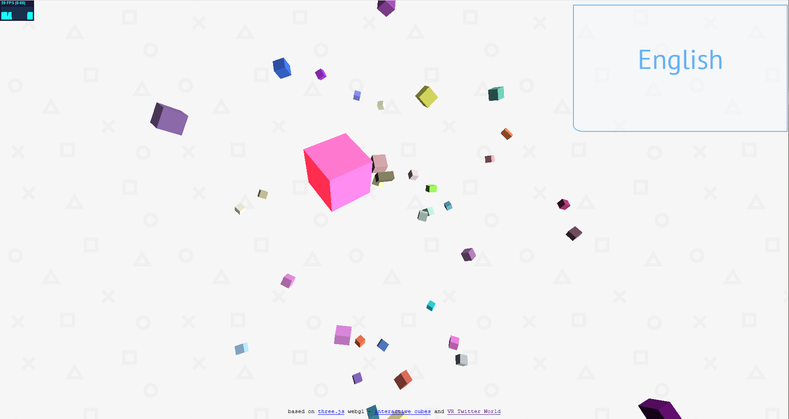

**Talking Cubes** is a small web app I made in 2017 to visualize languages used on Twitter. Each time a user tweets, a cube corresponding to the language changes in size for a moment. You can see what language it is by hovering over the cube. The project is based on [VR Twitter World](https://www.sitepoint.com/visualizing-a-twitter-stream-in-vr-with-three-js-and-node/) and a [Three JS example](https://threejs.org/examples/webgl_interactive_cubes.html).

## Live Demo

You can try a live demo [here](https://talkingcubes.herokuapp.com/).

## Screenshots

